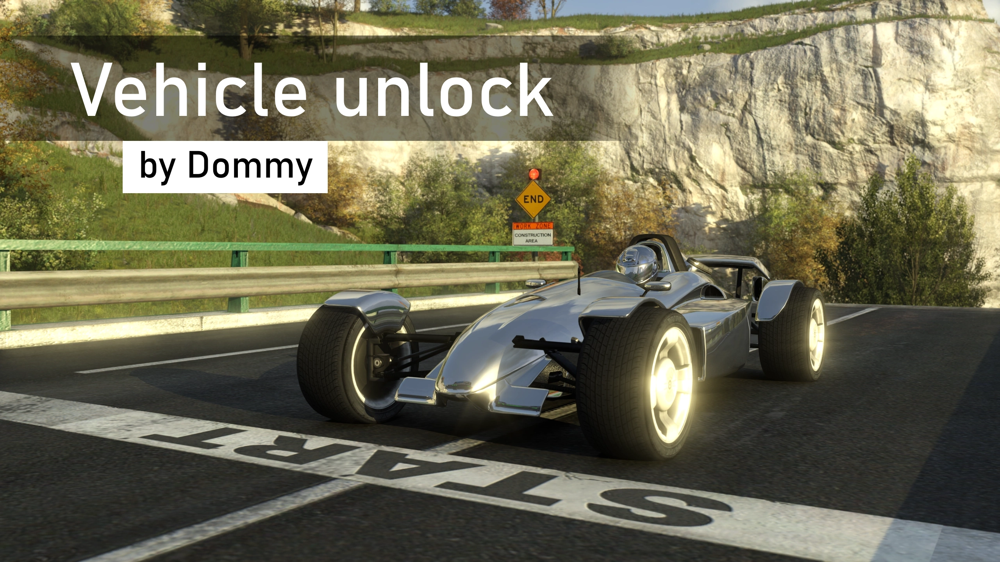
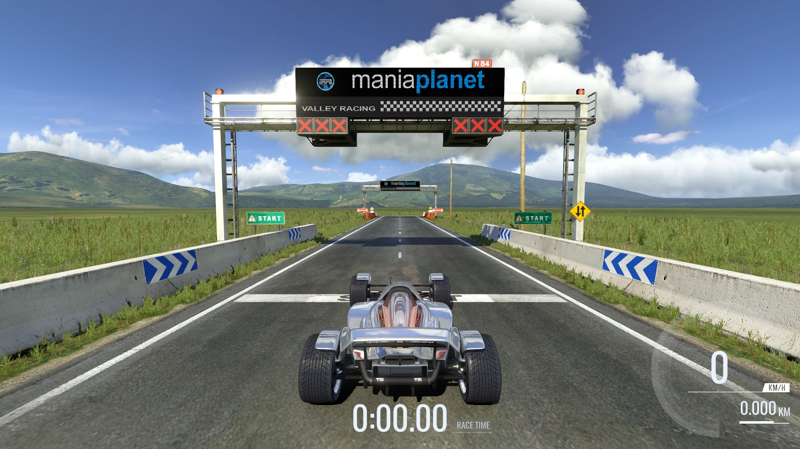
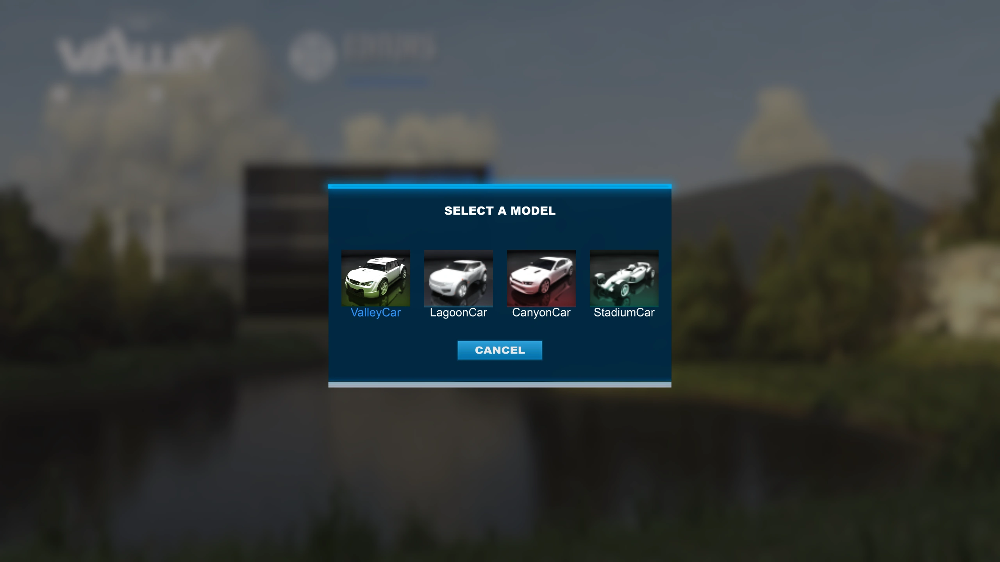

# Vehicle unlock

An [Openplanet](https://openplanet.dev) plugin, which enables play and editing of maps, which use vehicles other than the default one inside Nadeo base titles. For example, playing a Stadium Car map inside base Trackmania² Valley title.

## Features

* Stops the game from forcing the same car onto every map within a base title (Canyon, Valley, Lagoon, etc.).
* Restores "Select a model" prompt when Ctrl-clicking "Edit" on a map.
* Automatically enables itself inside Nadeo titles (titles with id ending with `@nadeo` and `@nadeolive`).
* Can be manually toggled on or off from the Plugins menu.

## Usage notes

* You don't need to own a game to use its car. All vehicles are available globally within ManiaPlanet.
* If the currently loaded title doesn't force a player model, the menu option is grayed out, because it's unnecessary.
* Stadium unlock is still required for accessing vehicles other than Stadium Car on Stadium maps.
* If you use a default skin on one of the cars, that skin will not appear until you've loaded into the base title the skin comes with. For example, a Canyon Car with GT500 skin will only have that skin applied if the Trackmania² Canyon title was entered before. Custom skins from the user data directory work normally.

## Installation

The plugin is available for download through [Openplanet plugins site](https://openplanet.dev/plugin/vehicleunlock). Can also be installed ingame through the Plugin Manager.

## Screenshots

